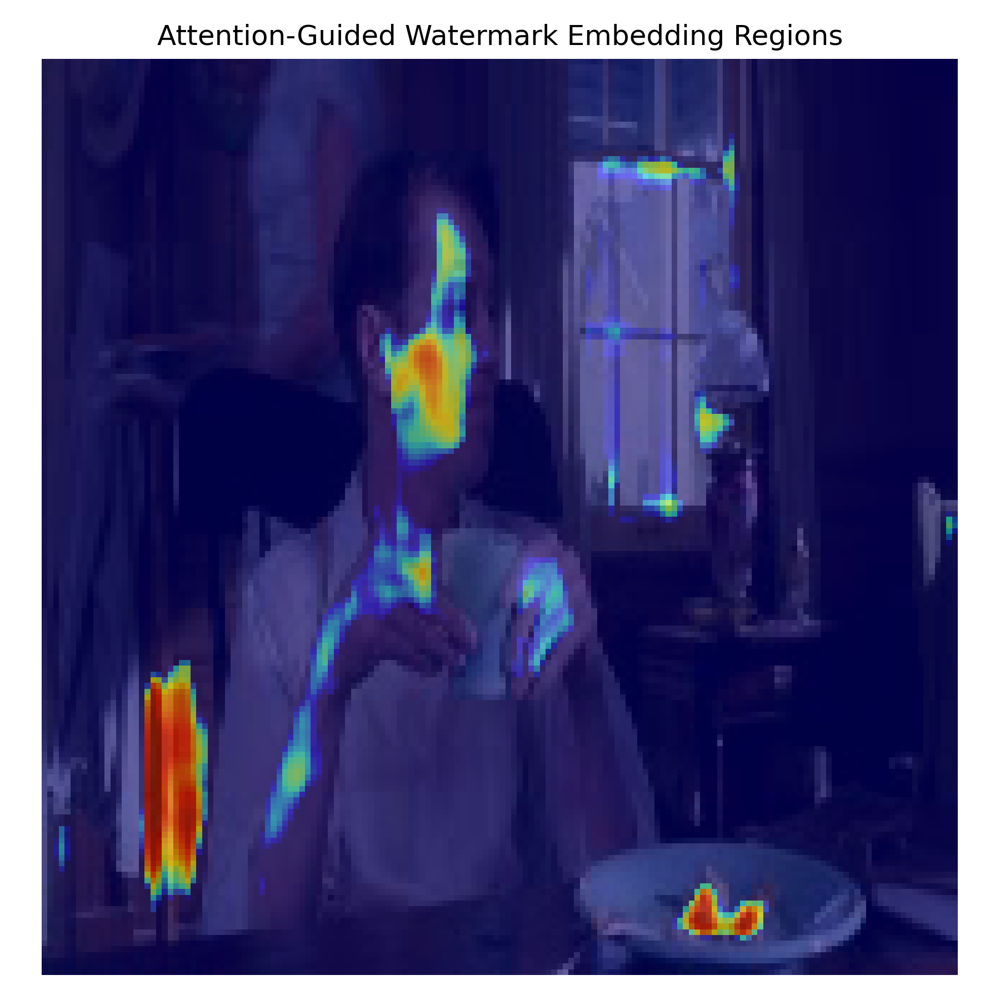
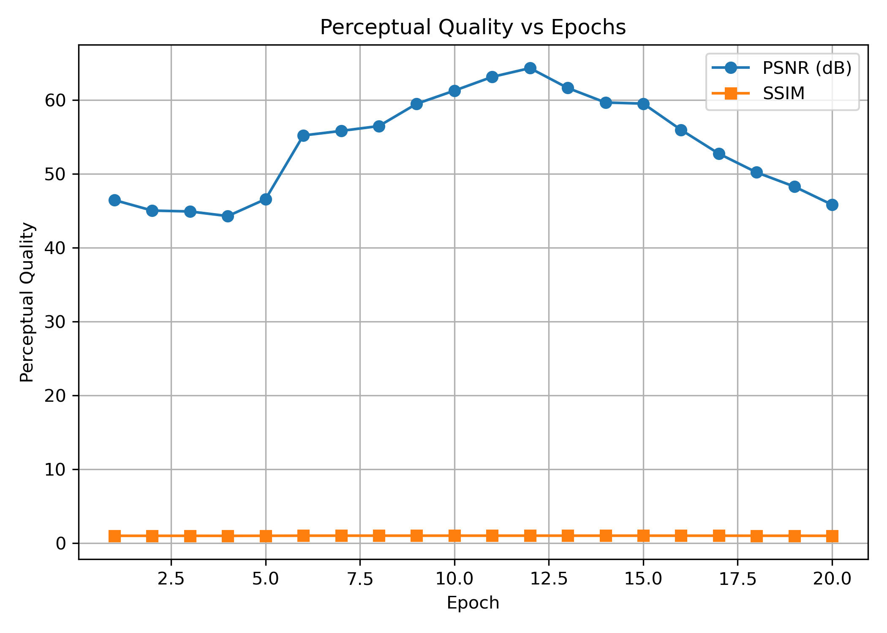
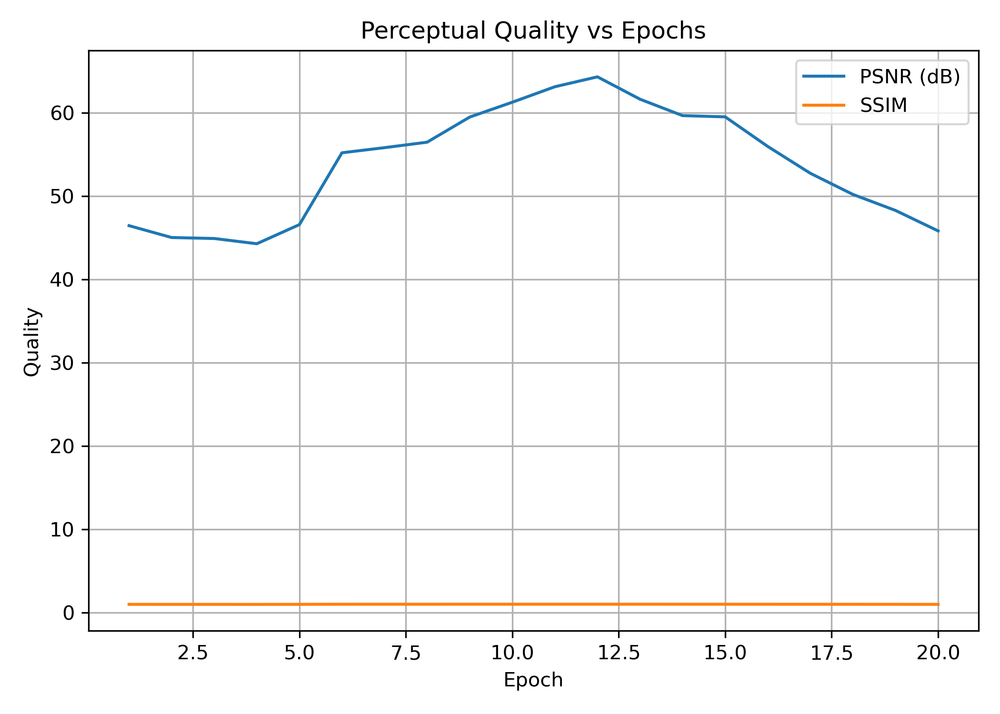
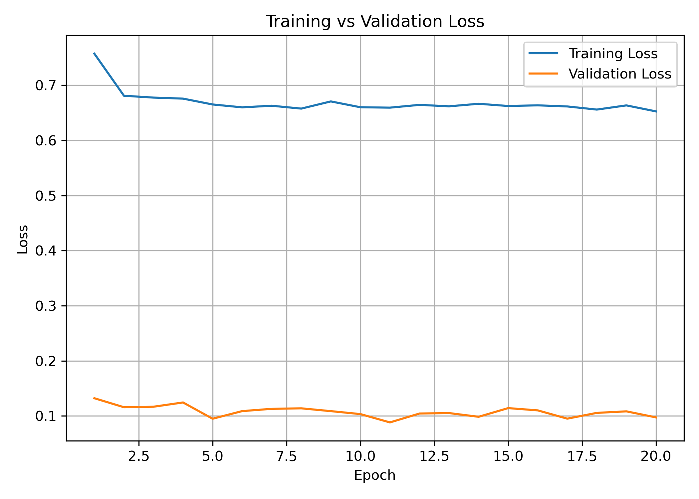
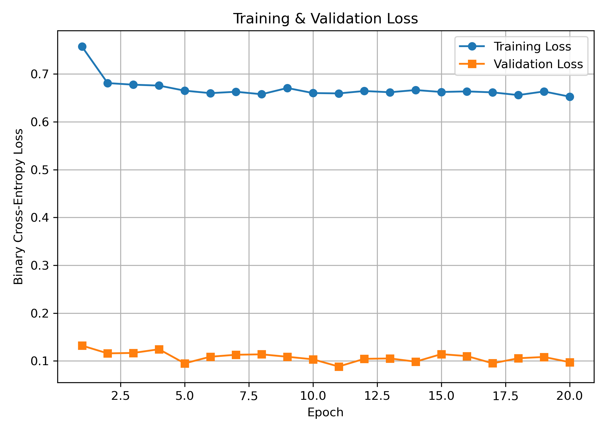

# rivagan-inspired-ai-video-watermarking
RivaGAN-Inspired AI Video Watermarking for Tamper Verification using Attention-Guided Deep Learning.
# RivaGAN-Inspired AI Video Watermarking for Tamper Verification

## Overview

This project implements an attention-guided deep learning framework for invisible video watermarking inspired by RivaGAN.

The system embeds a secret watermark into video frames and verifies media integrity by recovering the watermark after various video processing attacks.

---

## Features

- Attention-Guided Watermark Embedding
- 3D CNN Based Feature Learning
- Invisible Watermark Injection
- Watermark Recovery and Verification
- SHA-256 Integrity Verification
- Robustness Testing Against Common Attacks

---

## Attack Simulation

The watermark is evaluated under:

- Gaussian Noise
- Blur
- Crop
- Resize
- Quantization

---

## Technologies Used

- Python
- PyTorch
- OpenCV
- NumPy
- Matplotlib

---

## Evaluation Metrics

- PSNR
- SSIM
- Bit Recovery Accuracy

---

## Results

The model achieved:

- Peak PSNR: 64.35 dB
- Peak SSIM: 0.9998
- Successful watermark recovery under multiple attack conditions
- Robust performance against Gaussian Noise, Blur, Crop, Resize, and Quantization attacks
  
The model demonstrates:

- High visual quality after watermark embedding
- Strong watermark recovery performance
- Attention-guided embedding regions
- Robustness against common image/video attacks

## Visual Results

### Attention Heatmap

### PSNR and SSIM

### Quality Metrics

### Loss Curves

### Training Validation Loss

---

## Project Structure

attacks.py
attention_3d.py
blockchain.py
dataset.py
train_clean.py
inference_clean.py
visual_analysis_report.py

results/

---

## Note

This project is inspired by the RivaGAN watermarking framework and implements a lightweight attention-guided watermarking approach for educational and research purposes.
